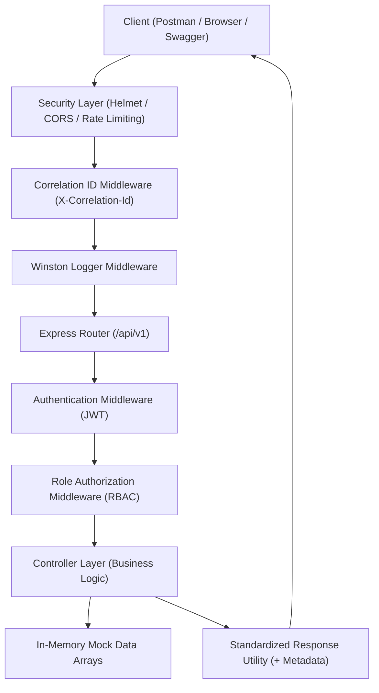
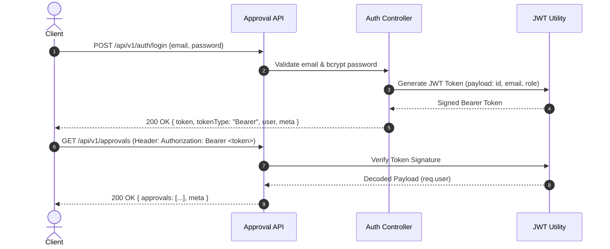

# Approval Management API — Production-Grade Engineering Foundation Project

[](https://nodejs.org/)
[](https://expressjs.com/)
[](https://jwt.io/)
[](https://swagger.io/)
[](https://github.com/winstonjs/winston)
[](https://jestjs.io/)

A complete, beginner-friendly RESTful backend API created for the **Algoriza Enterprise Full Stack Engineering Foundation Program (Week 1)**, updated with production-quality architecture enhancements.

This project demonstrates core backend fundamentals including RESTful API design, Express middleware pipelines, JWT authentication, role-based access control (RBAC), Winston logging, Correlation ID request tracing, rate limiting, security headers (Helmet/CORS), input validation, Swagger OpenAPI documentation, Jest automated testing, and clean architecture constants—without the overhead of external databases or complex ORMs.

---

## 📋 Table of Contents
- [Project Overview](#-project-overview)
- [Architecture & Diagrams](#-architecture--diagrams)
  - [High-Level Architecture Diagram](#high-level-architecture-diagram)
  - [Request Lifecycle Diagram](#request-lifecycle-diagram)
  - [Authentication Flow Diagram](#authentication-flow-diagram)
- [Folder Explanation](#-folder-explanation)
- [Technologies Used](#-technologies-used)
- [Installation & Setup](#-installation--setup)
- [Environment Variables](#-environment-variables)
- [Sample Users & Credentials](#-sample-users--credentials)
- [Authorization Matrix](#-authorization-matrix)
- [API Endpoints & Response Envelope](#-api-endpoints--response-envelope)
- [Correlation ID & Winston Logging](#-correlation-id--winston-logging)
- [Query Capabilities](#-query-capabilities)
- [Swagger UI Documentation](#-swagger-ui-documentation)
- [Postman Collection](#-postman-collection)
- [Automated Testing & Linting](#-automated-testing--linting)
- [Recommended Git Commit Timeline](#-recommended-git-commit-timeline)
- [Documentation Suite Links](#-documentation-suite-links)
- [Week 1 Learning Mapping Table](#-week-1-learning-mapping-table)

---

## 🎯 Project Overview

The **Approval Management API** simulates an enterprise internal approval system:
- **Employees** submit approval requests for equipment, software, or course reimbursements.
- **Managers** view incoming employee requests, approving or rejecting them.
- **Admins** have full system access to oversee all users and requests.

### Core Architectural Mandate
- **No External Database / No ORMs**: Data is managed strictly using in-memory JavaScript arrays (`users.data.js` and `approvals.data.js`).
- **Clean & Readable**: Code written with extensive comments using **CommonJS** (`require`/`module.exports`).

---

## 🏗 Architecture & Diagrams

### High-Level Architecture Diagram



---

### Request Lifecycle Diagram

```text
Incoming Request
      │
      ▼
 [Helmet Security Headers]
      │
      ▼
 [CORS Middleware]
      │
      ▼
 [Correlation ID Middleware] ──► Attaches req.correlationId & sets X-Correlation-Id header
      │
      ▼
 [Winston Logger Middleware] ──► Records request latency, IP, method, status
      │
      ▼
 [Express Rate Limiter] ───────► Caps at 100 req/min
      │
      ▼
 [Express JSON Parser]
      │
      ▼
 [Route Matcher & Controller Execution]
      │
      ▼
 Response Envelope: { success, message, data, meta: { timestamp, correlationId, version } }
```

---

### Authentication Flow Diagram



---

## 📁 Folder Explanation

```text
approval-management-api/
├── docs/                      # Comprehensive markdown guides
│   ├── AI_PROMPTS.md          # 3 AI prompts used during development & engineering explanations
│   ├── API_EXAMPLES.md        # Complete JSON request & response payloads for all endpoints
│   ├── GIT_WORKFLOW.md        # Branching strategy, PR guidelines & commit timeline
│   ├── LEARNING_NOTES.md      # Summary of Week 1 core backend learnings
│   └── REST_API_BASICS.md     # Fundamentals of REST, HTTP methods, status codes & JSON design
├── logs/                      # Winston log files (automatically generated)
│   ├── app.log                # Standard operational logs
│   └── error.log              # Error trace logs
├── postman/
│   └── ApprovalManagement.postman_collection.json  # Importable Postman test suite
├── src/
│   ├── app.js                 # Express application configuration & middleware registration
│   ├── server.js              # HTTP server entrypoint
│   ├── config/
│   │   ├── constants.js       # Core API prefix, version, and JWT expiration constants
│   │   ├── env.js             # Centralized environment configuration & fail-fast validation
│   │   └── swagger.config.js  # OpenAPI 3.0 specification & schema definitions
│   ├── constants/             # Eliminates magic strings
│   │   ├── approvalStatus.js  # PENDING, APPROVED, REJECTED
│   │   ├── httpStatus.js      # 200, 201, 400, 401, 403, 404, 429, 500
│   │   ├── messages.js        # Standardized message strings
│   │   └── roles.js           # Admin, Manager, Employee
│   ├── controllers/
│   │   ├── approval.controller.js  # Approvals CRUD, filtering, search, pagination
│   │   ├── auth.controller.js      # Authentication & JWT generation
│   │   └── user.controller.js      # User management & profile retrieval
│   ├── data/
│   │   ├── approvals.data.js   # In-memory approval requests array
│   │   └── users.data.js       # In-memory mock users array (bcrypt hashed passwords)
│   ├── middleware/
│   │   ├── auth.middleware.js       # JWT Bearer token verification
│   │   ├── correlationId.middleware.js # Unique UUID request tracing
│   │   ├── error.middleware.js      # Global error handler with trace sanitization
│   │   ├── logger.middleware.js     # Winston HTTP latency logger
│   │   ├── notFound.middleware.js   # 404 unmatched route handler
│   │   ├── rateLimit.middleware.js  # Rate limiting (100 req/min)
│   │   ├── role.middleware.js       # Role-Based Access Control (RBAC)
│   │   └── validation.middleware.js # Express-validator result formatter
│   ├── routes/
│   │   ├── approval.routes.js  # Approval endpoint routes
│   │   ├── auth.routes.js      # Auth endpoint routes
│   │   ├── index.js           # Main router & health check endpoint
│   │   └── user.routes.js      # User endpoint routes
│   └── utils/
│       ├── appError.util.js   # Custom operational AppError class
│       ├── jwt.util.js        # Token signing & verification functions
│       ├── logger.util.js     # Winston Logger instance
│       └── response.util.js   # Standardized JSON response envelope helper
├── tests/
│   ├── approval.test.js       # Jest/Supertest suite for approval endpoints
│   ├── auth.test.js           # Jest/Supertest suite for login authentication
│   └── health.test.js         # Jest/Supertest suite for health endpoint
├── .eslintrc.json             # ESLint rules configuration
├── .prettierrc                # Prettier code formatting config
├── .env                       # Environment variables file
├── .env.example               # Environment variables template
├── package.json               # Node.js project manifest & dependencies
└── README.md                  # Complete project documentation
```

---

## ⚡ Technologies Used

- **Runtime**: Node.js (v18+)
- **Framework**: Express.js (v4.19)
- **Security & Traffic Control**: `helmet`, `cors`, `express-rate-limit`
- **Logging**: `winston`
- **Authentication**: `jsonwebtoken` (JWT) & `bcryptjs`
- **Validation**: `express-validator`
- **Documentation**: Swagger OpenAPI 3.0 (`swagger-ui-express`, `swagger-jsdoc`)
- **Testing & Quality**: Jest, Supertest, ESLint, Prettier
- **Utilities**: `uuid`, `dotenv`

---

## 🚀 Installation & Setup

1. **Clone the Repository**:
   ```bash
   git clone <repository-url>
   cd "d:/Algoriza/Assignment Weeks/week 1"
   ```

2. **Install Dependencies**:
   ```bash
   npm install
   ```

3. **Configure Environment Variables**:
   ```bash
   cp .env.example .env
   ```

4. **Run Server in Development Mode**:
   ```bash
   npm run dev
   ```

5. **Run Linting & Tests**:
   ```bash
   npm run lint
   npm test
   ```

---

## ⚙️ Environment Variables

Located in `.env`:

| Variable | Default Value | Required? | Description |
| :--- | :--- | :---: | :--- |
| `PORT` | `3000` | No | Port for the HTTP server |
| `NODE_ENV` | `development` | No | Environment mode (`development` / `production`) |
| `JWT_SECRET` | `super_secret_jwt_key...` | **Yes** | Secret key used for signing JWT tokens (Fails fast if missing) |
| `JWT_EXPIRES_IN` | `24h` | No | JWT token expiration duration |

---

## 👥 Sample Users & Credentials

Passwords are pre-hashed using `bcryptjs` for security simulation:

| Name | Email | Password | Role | Access Scope |
| :--- | :--- | :--- | :--- | :--- |
| **System Admin** | `admin@example.com` | `admin123` | `Admin` | Full System Control |
| **Sarah Jenkins** | `manager@example.com` | `manager123` | `Manager` | View All Requests, Approve, Reject |
| **John Doe** | `employee@example.com` | `employee123` | `Employee` | Create Request, View/Edit/Delete Own Pending Requests |
| **Alice Smith** | `alice@example.com` | `employee123` | `Employee` | Create Request, View/Edit/Delete Own Pending Requests |

---

## 🛡 Authorization Matrix

| Endpoint | Action | Employee | Manager | Admin |
| :--- | :--- | :---: | :---: | :---: |
| `POST /api/v1/auth/login` | Login | ✅ | ✅ | ✅ |
| `GET /api/v1/users` | List All Users | ❌ (403) | ✅ | ✅ |
| `GET /api/v1/users/:id` | View User Profile | ✅ (Self Only) | ✅ | ✅ |
| `GET /api/v1/approvals` | List Approvals | ✅ (Own Only) | ✅ (All) | ✅ (All) |
| `GET /api/v1/approvals/:id` | View Approval | ✅ (Own Only) | ✅ (Any) | ✅ (Any) |
| `POST /api/v1/approvals` | Create Approval | ✅ | ✅ | ✅ |
| `PUT /api/v1/approvals/:id` | Update Approval | ✅ (Own Pending) | ❌ | ✅ |
| `DELETE /api/v1/approvals/:id` | Delete Approval | ✅ (Own Pending) | ❌ | ✅ |
| `POST /api/v1/approvals/:id/approve` | Approve Request | ❌ (403) | ✅ | ✅ |
| `POST /api/v1/approvals/:id/reject` | Reject Request | ❌ (403) | ✅ | ✅ |

---

## 🌐 API Endpoints & Response Envelope

### Standardized Response Envelope with Metadata
All API responses return a structured envelope containing a `meta` block:

```json
{
  "success": true,
  "message": "Approval requests retrieved successfully.",
  "data": { ... },
  "meta": {
    "timestamp": "2026-08-04T22:20:00.000Z",
    "correlationId": "8f3b2c1a-4d5e-6f7a-8b9c-0d1e2f3a4b5c",
    "version": "v1"
  }
}
```

---

## 🔍 Correlation ID & Winston Logging

Every request is tracked using a unique UUID `X-Correlation-Id`.

Logs are persisted structured in:
- `logs/app.log`: Operational info logs.
- `logs/error.log`: Error stack trace logs.

### Sample Winston Log Output:
```text
[2026-08-04 22:20:01.123] [INFO] [CID:8f3b2c1a-4d5e-6f7a-8b9c-0d1e2f3a4b5c] GET /api/v1/approvals | Status: 200 | Time: 4ms | IP: 127.0.0.1 | User:usr-3(Employee) | HTTP Request completed
```

---

## 🔍 Query Capabilities

`GET /api/v1/approvals` supports rich query strings:
- **Status Filter**: `?status=PENDING`
- **Requester Filter**: `?requesterId=usr-3`
- **Keyword Search**: `?search=MacBook`
- **Sorting**: `?sort=createdAt&sortDirection=desc`
- **Pagination**: `?page=1&pageSize=10`

---

## 📚 Swagger UI Documentation

Interactive OpenAPI 3.0 documentation is served at:
- **URL**: `http://localhost:3000/api-docs`

---

## 🔀 Recommended Git Commit Timeline

Below is the recommended git commit history reflecting gradual, professional development:

```text
commit 1: Initial Setup
commit 2: Authentication
commit 3: Authorization
commit 4: Approval CRUD
commit 5: Filtering & Pagination
commit 6: Swagger
commit 7: Testing
commit 8: Logging
commit 9: Documentation
commit 10: Final Improvements
```

---

## 📄 Documentation Suite Links

- 📖 [REST_API_BASICS.md](docs/REST_API_BASICS.md) — REST concepts & HTTP status codes
- 📜 [API_EXAMPLES.md](docs/API_EXAMPLES.md) — JSON request & response payloads
- 🌿 [GIT_WORKFLOW.md](docs/GIT_WORKFLOW.md) — Git branching & pull requests
- 📝 [LEARNING_NOTES.md](docs/LEARNING_NOTES.md) — Key Week 1 engineering notes
- 🤖 [AI_PROMPTS.md](docs/AI_PROMPTS.md) — AI prompt engineering log

---

## 📊 Week 1 Learning Mapping Table

| Week 1 Concept | Status | Implementation Artifact |
| :--- | :---: | :--- |
| **REST API Concepts** | ✅ | Standard URIs & HTTP verbs in `src/routes/` |
| **Status Codes & Envelopes** | ✅ | Standardized `{ success, message, data, meta }` in `response.util.js` |
| **JWT Authentication** | ✅ | Implemented in `auth.controller.js` & `auth.middleware.js` |
| **Role-Based Authorization** | ✅ | RBAC middleware in `role.middleware.js` |
| **Winston Logging & Tracing** | ✅ | Configured in `logger.util.js` & `correlationId.middleware.js` |
| **Security & Rate Limiting** | ✅ | `helmet`, `cors`, `express-rate-limit` in `app.js` |
| **Code Quality & Linting** | ✅ | Configured via `.eslintrc.json`, `.prettierrc`, and constants |
| **Swagger Documentation** | ✅ | Interactive UI at `/api-docs` via `swagger.config.js` |
| **Automated Testing** | ✅ | Jest & Supertest suites under `tests/` |
| **Week 1 Mapping Table** | ✅ | Embedded in [README.md](file:///d:/Algoriza/Assignment%20Weeks/week%201/README.md) |
